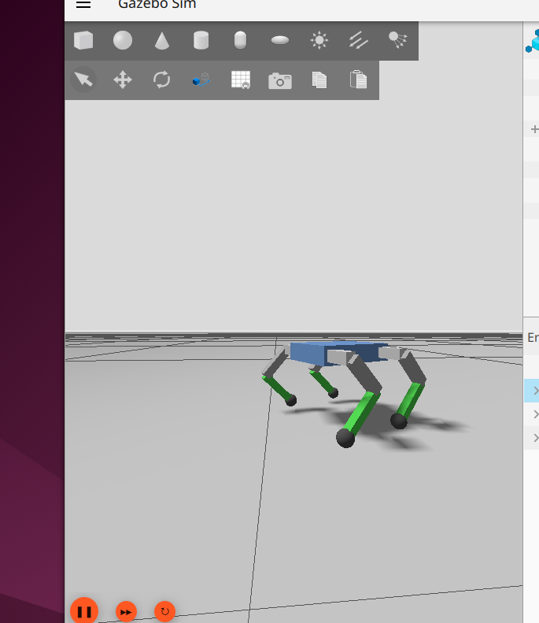

# Spider Bot — 12 DOF Quadruped Robot (ROS 2 + Gazebo Harmonic)

A 12-DOF quadruped spider robot simulated in Gazebo Harmonic using ROS 2 Jazzy.
Built with analytical Inverse Kinematics and a trot gait pattern.
URDF structure and ROS 2 conventions developed with assistance from Claude (Anthropic).
All dimensions, IK mathematics, and gait logic are specific to this hardware build.

---

## Robot Specifications

| Part | Length |
|------|--------|
| Coxa (L1) | 3.5 cm |
| Femur (L2) | 7.0 cm |
| Tibia (L3) | 7.5 cm |
| Body | 15 × 11 × 4.5 cm |
| Total legs | 4 legs × 3 joints = 12 DOF |

---

## How It Works

### Leg Layout

```
        +Y (left side)
             │
  FL (+1)    │    FR (-1)
  ───────────┼─────────── +X (forward)
  RL (+1)    │    RR (-1)
             │
           -Y (right side)
```

Left legs extend in +Y → `outward_sign = +1`
Right legs extend in -Y → `outward_sign = -1`

---

### Inverse Kinematics

Given a target foot position (px, py, pz), the IK solver finds the three joint angles:

**Step 1 — θ1 (coxa) using atan2:**

```
              90°
               │
  atan2 ✓      │      atan2 ✓
  (-x, +y)     │      (+x, +y)
               │
180° ──────────┼────────────── 0°
               │
  atan2 ✓      │      atan2 ✓
  (-x, -y)     │      (+x, -y)
               │
             -90°
```

`atan2(py, px)` is used instead of regular `arctan` because it works in all
four quadrants. Regular arctan is limited to ±90° and loses sign information
when dividing y/x.

**Step 2 — θ3 (knee) using the Cosine Rule:**

```
Femur joint
    |\
    | \  d  (straight line from femur joint to foot — calculated from target)
 L2 |  \
    |   \
    |    \ Foot position
    | θ3 /
 L3 |   /
    |  /
    | /
    |/
  Knee
```

```
cos(θ3) = (d² - L2² - L3²) / (2 × L2 × L3)
```

All three sides of the triangle (L2, L3, d) are known so the cosine
rule gives the knee angle directly.

**Step 3 — θ2 (hip) using atan2:**

Solved last because it depends on θ3.

**Why this order (θ1 → θ3 → θ2)?**

Each joint is solved when all its dependencies are known:
- θ1 only needs the target position
- θ3 only needs link lengths and d
- θ2 needs θ3 first, so it's solved last

---

### Trot Gait

Diagonal leg pairs move together so two feet are always on the ground:

```
Time →        0         π         2π
FL    |  SWING ──►  | STANCE ──► |
RR    |  SWING ──►  | STANCE ──► |  ← FL and RR in sync (phase offset 0.0)
FR    | STANCE ──►  |  SWING ──► |
RL    | STANCE ──►  |  SWING ──► |  ← FR and RL in sync (phase offset π)
```

Each foot follows this trajectory per cycle:

```
SWING  (in air):    ___/‾‾‾\___   smooth arc forward
STANCE (on ground): ___________   pushes backward → robot moves forward
```

---

### Gait Tuning Parameters

| Parameter | Default | Effect |
|-----------|---------|--------|
| `STEP_LENGTH` | 0.03 m | Longer = bigger strides |
| `STEP_HEIGHT` | 0.015 m | Higher = more foot lift |
| `GAIT_HZ` | 0.5 | Higher = faster walking |
| `HOME_PY` | 0.08 m | Higher = wider stance |
| `HOME_Z` | -0.10 m | More negative = lower crouch |

---

## Project Structure

```
ros2_ws/
└── src/
    └── spider_bot_description/
        ├── spider_bot_description/
        │   ├── __init__.py               ← auto-generated
        │   └── walk_forward.py           ← CREATE MANUALLY — IK + gait node
        ├── urdf/
        │   └── spider_bot.urdf           ← CREATE MANUALLY — robot blueprint
        ├── config/
        │   └── controllers.yaml          ← CREATE MANUALLY — ros2_control setup
        ├── launch/
        │   ├── display.launch.py         ← CREATE MANUALLY — RViz viewer
        │   └── gazebo.launch.py          ← CREATE MANUALLY — full simulation
        ├── resource/
        │   └── spider_bot_description    ← auto-generated
        ├── package.xml                   ← auto-generated (edit description)
        ├── setup.cfg                     ← auto-generated
        └── setup.py                      ← auto-generated (edit manually)
```

---

## Setup From Scratch

### 1. Create workspace

```bash
mkdir -p ~/ros2_ws/src
cd ~/ros2_ws/src
```

### 2. Create ROS 2 package

```bash
ros2 pkg create --build-type ament_python spider_bot_description
cd spider_bot_description
```

### 3. Create folders for manual files

```bash
mkdir urdf
mkdir config
mkdir launch
```

### 4. Create the files manually

Copy these files into the correct folders:

| File | Destination |
|------|-------------|
| `spider_bot.urdf` | `urdf/` |
| `controllers.yaml` | `config/` |
| `display.launch.py` | `launch/` |
| `gazebo.launch.py` | `launch/` |
| `walk_forward.py` | `spider_bot_description/` |

### 5. Edit setup.py

Add imports at the top:
```python
import os
from glob import glob
```

Replace `data_files` with:
```python
data_files=[
    ('share/ament_index/resource_index/packages',
        ['resource/' + package_name]),
    ('share/' + package_name, ['package.xml']),
    (os.path.join('share', package_name, 'urdf'),
        glob('urdf/*.urdf')),
    (os.path.join('share', package_name, 'launch'),
        glob('launch/*.py')),
    (os.path.join('share', package_name, 'config'),
        glob('config/*.yaml')),
],
```

Replace `console_scripts` with:
```python
'console_scripts': [
    'walk_forward = spider_bot_description.walk_forward:main',
],
```

### 6. Install dependencies

```bash
sudo apt install ros-jazzy-gz-ros2-control \
                 ros-jazzy-ros2-controllers \
                 ros-jazzy-ros2-control \
                 ros-jazzy-joint-state-publisher-gui
```

### 7. Build

```bash
cd ~/ros2_ws
colcon build --packages-select spider_bot_description
source install/setup.bash
```

### 8. Add to bashrc (do once)

```bash
echo 'source /opt/ros/jazzy/setup.bash' >> ~/.bashrc
echo 'source ~/ros2_ws/install/setup.bash' >> ~/.bashrc
echo 'export GZ_SIM_SYSTEM_PLUGIN_PATH=/opt/ros/jazzy/lib:$GZ_SIM_SYSTEM_PLUGIN_PATH' >> ~/.bashrc
source ~/.bashrc
```

### 9. Launch in Gazebo

```bash
ros2 launch spider_bot_description gazebo.launch.py
```

### 10. Launch in RViz (for debugging only)

```bash
ros2 launch spider_bot_description display.launch.py
```

---

## Output



---

## Requirements

- Ubuntu 22.04 / 24.04
- ROS 2 Jazzy
- Gazebo Harmonic
- Python 3.10+

---

## Author

**Anup** — MSc CS, Robotics & Automation, HAM Munich


---

## License

MIT
